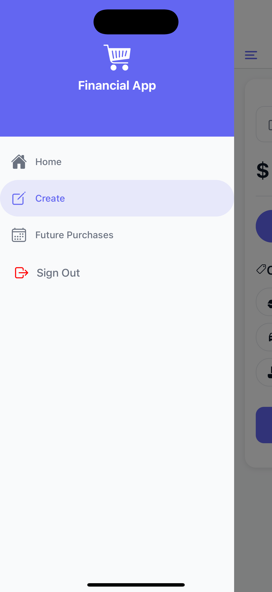
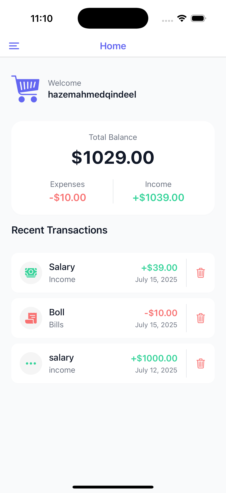
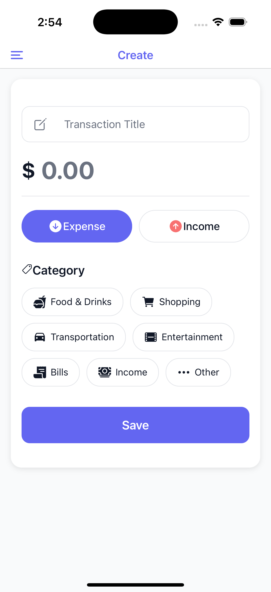
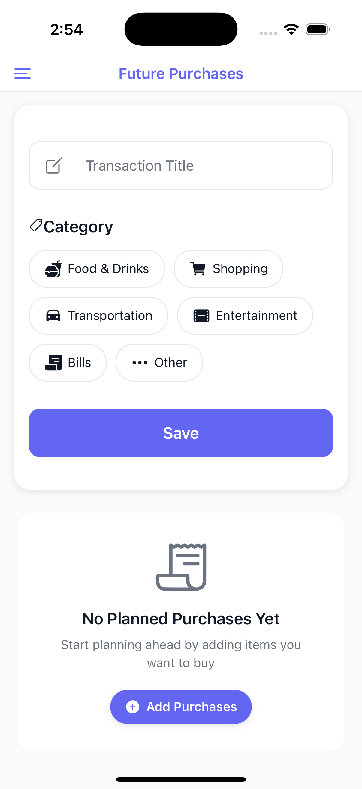

# Financial Activity App 📱💰

A modern mobile application built with Expo and React Native for managing personal finances and tracking financial activities.

## Features ✨

- 🔐 Secure authentication with Clerk
- 💰 Track income and expenses
- 📊 View financial summaries and balances
- 🛒 Plan future purchases
- 📱 Beautiful and responsive UI
- ⚡ Real-time updates
- 🔄 Offline support

## Technologies Used 🛠

- [Expo](https://expo.dev) - React Native development framework
- [Clerk](https://clerk.dev) - Authentication and user management
- [React Navigation](https://reactnavigation.org) - Navigation system
- [TypeScript](https://www.typescriptlang.org/) - Type-safe development
- [Expo Router](https://docs.expo.dev/router/introduction/) - File-based routing


## App Screenshots

<p align="center">
  
  
  
  
</p>

## Prerequisites 📋

Before you begin, ensure you have the following installed:

- [Node.js](https://nodejs.org/) (version 14 or higher)
- [npm](https://www.npmjs.com/) or [yarn](https://yarnpkg.com/)
- [Expo CLI](https://docs.expo.dev/workflow/expo-cli/)

## Get started 🚀

1. Install dependencies

   ```bash
   npm install
   ```

2. Start the app

   ```bash
   npx expo start
   ```

## Development Options 💻

You can run the app on:

- 📱 [Expo Go](https://expo.dev/go) - Quick testing and development
- 🤖 [Android Emulator](https://docs.expo.dev/workflow/android-studio-emulator/)
- 🍎 [iOS Simulator](https://docs.expo.dev/workflow/ios-simulator/)
- 🛠 [Development Build](https://docs.expo.dev/develop/development-builds/introduction/)

## Project Structure 📁

```
app/               # Application screens and navigation
├── (auth)/       # Authentication related screens
└── (root)/       # Main app screens
assets/           # Static assets (images, fonts, styles)
components/       # Reusable UI components
constants/        # App constants and configurations
Hook/             # Custom React hooks
types/            # TypeScript type definitions
utils/            # Utility functions
```

## Contributing 🤝

1. Fork the repository
2. Create your feature branch (`git checkout -b feature/amazing-feature`)
3. Commit your changes (`git commit -m 'Add some amazing feature'`)
4. Push to the branch (`git push origin feature/amazing-feature`)
5. Open a Pull Request

## Learn More 📚

- [Expo Documentation](https://docs.expo.dev/)
- [React Native Documentation](https://reactnative.dev/)
- [Clerk Documentation](https://clerk.dev/docs)

## Support 💪

If you have any questions or need help, please open an issue in the repository or contact the development team.
